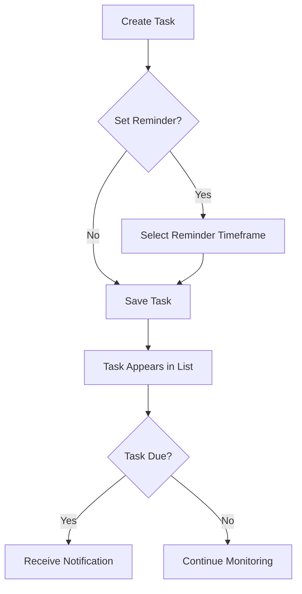
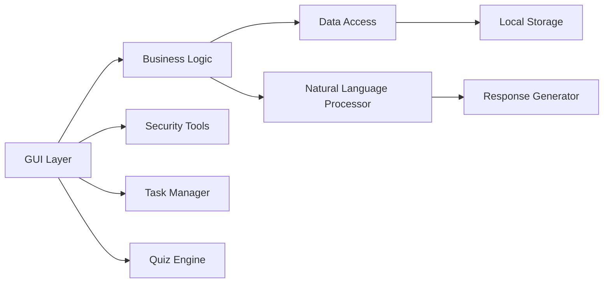

# Leo CyberSafe Cybersecurity Awareness Chatbot

  
*Comprehensive cybersecurity education and protection in one application*

## Table of Contents
- [Introduction](#introduction)
- [Features](#features)
- [Installation](#installation)
- [Usage Guide](#usage-guide)
- [Technical Details](#technical-details)
- [Contributing](#contributing)
- [License](#license)
- [Demo](#demo)

## Introduction <a name="introduction"></a>
Leo CyberSafe is an advanced cybersecurity awareness chatbot that helps users learn about digital security through interactive features. Built with WPF and .NET 9, this application combines chatbot functionality with educational tools to make cybersecurity accessible to everyone.

**Key Objectives**:
- Educate users on cybersecurity best practices
- Provide interactive tools for security self-assessment
- Help users manage security-related tasks
- Test knowledge through engaging quizzes

## Features <a name="features"></a>

### 🗣️ Intelligent Chatbot
- Context-aware responses to cybersecurity questions
- Sentiment analysis to adapt responses to user emotions
- Conversation memory for personalized interactions
- Natural language processing for task management

### 🛡️ Security Toolkit
| Feature | Description |
|---------|-------------|
| **Password Auditor** | Analyze password strength with detailed feedback |
| **Phishing Simulator** | Test your ability to identify phishing attempts |
| **Threat Scanner** | Generate mock security reports with vulnerability analysis |
| **Secure Notes** | Encrypted note storage with master password protection |
| **Security Tips** | Contextual cybersecurity advice based on user queries |

### 📝 Task Management
- Create security-related tasks with reminders
- Set due dates and notification preferences
- Track completion status
- Receive timely reminders for important actions

### 🎮 Cybersecurity Quiz
- 10-question interactive quiz on security fundamentals
- Multiple-choice format with immediate feedback
- Score tracking and performance evaluation
- Educational explanations for each answer

### 📊 Activity Logging
- Track all user interactions and system actions
- View timestamped history of activities
- Accessible through "Show activity log" command

## Installation <a name="installation"></a>


### Installation Steps
1. Download the latest release from [Releases Page](https://github.com/yourusername/LeoCyberSafe/releases)
2. Run the installer `LeoCyberSafe-Installer.exe`
3. Follow the installation wizard prompts
4. Launch from Start Menu or desktop shortcut

```bash
# For developers
git clone https://github.com/yourusername/LeoCyberSafe.git
cd LeoCyberSafe
dotnet restore
dotnet build
dotnet run --project LeoCyberSafeGUI
```

## Usage Guide <a name="usage-guide"></a>

### Getting Started
1. Launch Leo CyberSafe
2. Type your cybersecurity questions in the chat interface
3. Explore the various tabs for different security tools

### Key Interactions
| Command | Example | Response |
|---------|---------|----------|
| **Ask question** | "How do I create strong passwords?" | Detailed password best practices |
| **Add task** | "Remind me to update software next week" | Creates task with reminder |
| **Start quiz** | "Begin cybersecurity test" | Launches interactive quiz |
| **View logs** | "Show activity log" | Displays recent activities |
| **Security tools** | "Run password audit" | Analyzes password strength |

### Task Management


### Quiz Flow
1. Navigate to Quiz Game tab
2. Click "Start Quiz"
3. Answer 10 multiple-choice questions
4. Receive immediate feedback after each question
5. Get final score with performance evaluation

## Technical Details <a name="technical-details"></a>

### Architecture


### Technologies
- **Frontend**: WPF/XAML with MVVM pattern
- **Backend**: .NET 9.0
- **Security**: AES-256 encryption for secure notes
- **Dependencies**:
  - `Microsoft.VisualBasic` for input dialogs
  - `System.Drawing.Common` for UI elements
  - `System.Security.Cryptography` for encryption

### File Structure
```
/LeoCyberSafe
│
├── Core
│   ├── Models      # Data models
│   └── Services    # Business logic services
│
├── Features
│   ├── Password    # Password audit tools
│   ├── Phishing    # Phishing simulation
│   ├── Questions   # Question-answer system
│   └── Response    # Response generation
│
├── GUI             # WPF application
│   ├── Views       # XAML views
│   └── ViewModels  # ViewModel classes
│
├── Utilities       # Helper classes
└── Resources       # Assets and data files
```

## Demo <a name="demo"></a>
Watch our video demonstration to see Leo CyberSafe in action:

[![Demo Video][https://youtu.be/kRhsLQkQivI]

*Full video link: https://youtu.be/kRhsLQkQivI
---

**Created with ❤️ by Leo Van Niekerk**  
